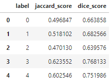
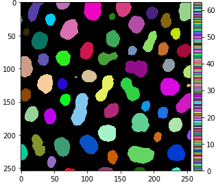

# biapol-utilities
[](https://python.org)
[](https://github.com/BiAPoL/biapol-utilities/actions/workflows/test.yml)
[](https://github.com/BiAPoL/biapol-utilities/graphs/contributors)
[](https://codecov.io/gh/BiAPoL/biapol-utilities)

Collection of utility functions from the BiA-PoL group at the DFG Cluster of Excellence "Physics of Life" (PoL) @ TU Dresden, Germany. 

## Usage 

This library contains functions for comparing and visualizing label images. For example, comparing label images is as easy as this:
```python
import biapol_utilities as biau

biau.label.compare_labels(ground_truth, segmented)
```


In another example, you can visualize a label image with a nice color map like this:

```python
import biapol_utilities as biau
from skimage.io import imshow

imshow(label_image, cmap=biau.labels_colormap(), vmin=0, vmax=labels.max())
```


More examples are available in our [our example notebooks](https://github.com/BiAPoL/biapol-utilities/tree/main/docs/_include/notebooks/label).
Also read our [documentation](https://biapol.github.io/biapol-utilities).

## Installation

`biapol-utilities` can be installed using pip:

`pip install biapol-utilities`

If you want to develop `biapol-utilities` you can download and install it like this:

```
git clone https://github.com/BiAPoL/biapol-utilities
cd biapol-utilities
pip install -e .
```

## Ressources

* [Documentation](https://biapol.github.io/biapol-utilities)
* [Source code](https://github.com/BiAPoL/biapol-utilities)
* [Bug reports are welcome here](https://github.com/BiAPoL/biapol-utilities/issues)
* [How to contribute](https://biapol.github.io/biapol-utilities/_include/Contribute.html)

## Acknowledgements
Developing biapol-utilities is a community effort. We would like to thank everybody who helped developing and testing. 
Furthermore, we are gladly re-using code from other open source projects. 
See the the [thirdparty-licenses folder](https://github.com/BiAPoL/biapol-utilities/tree/main/license_thirdparty) for details.
